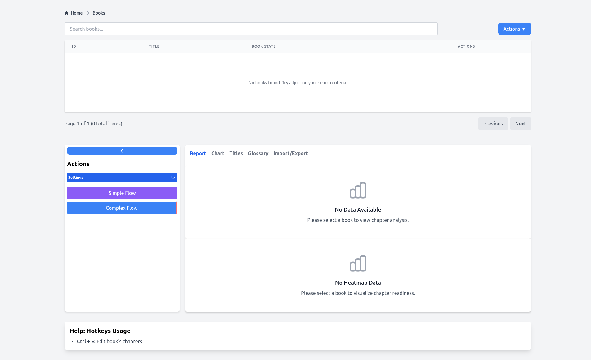
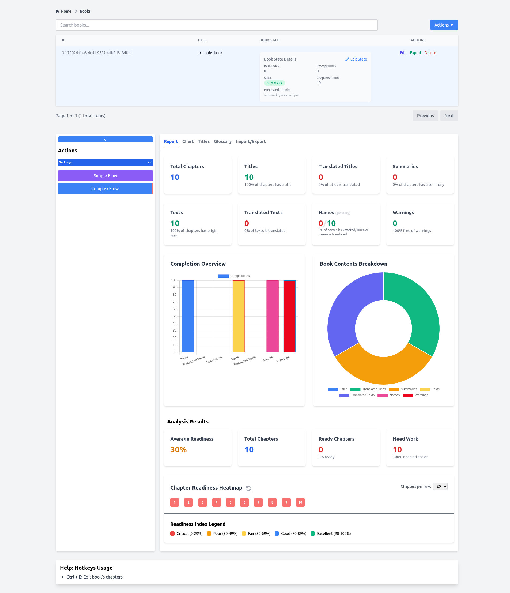
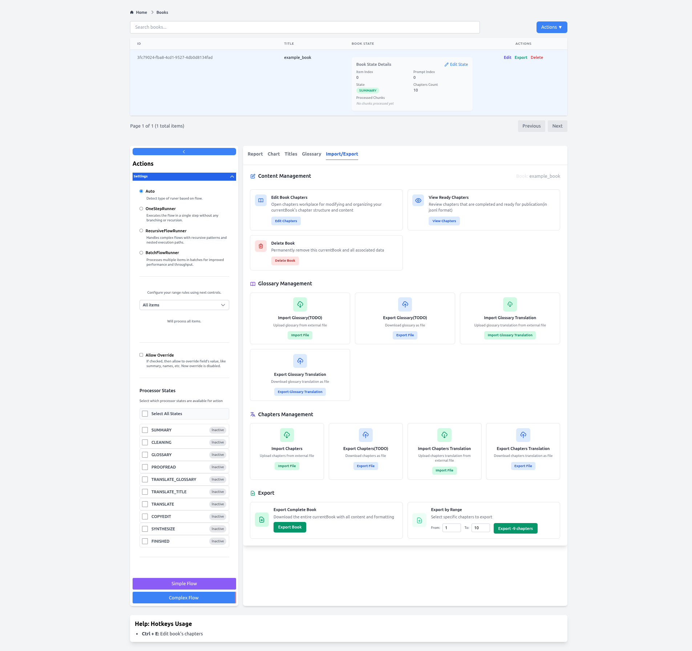
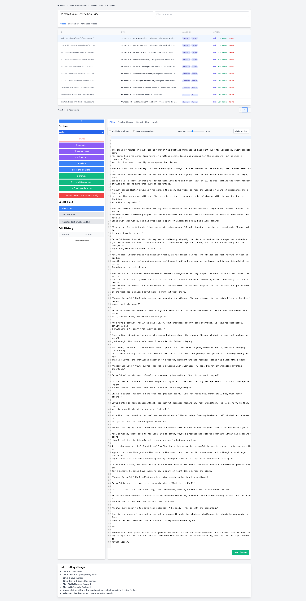
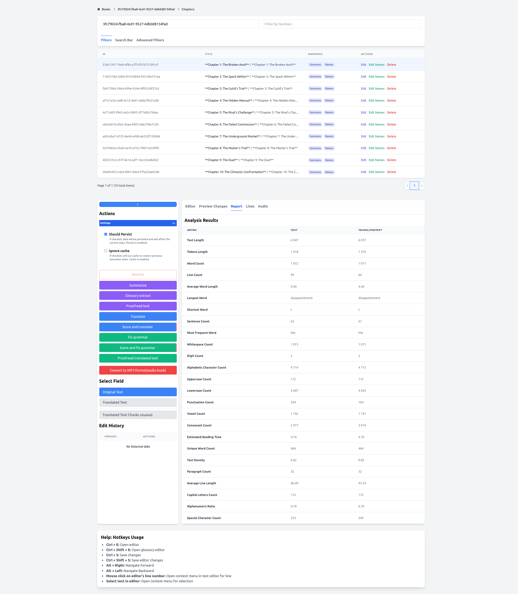

# Machinum-LLM

**Machinum-LLM** is an AI-powered book translation application designed to automate and enhance the process of
translating books using large language models (LLMs). The system supports multiple languages, integrates with local LLMs
via Ollama, and provides advanced features such as proofreading, glossary extraction, summarization, and text splitting
for optimal translation quality.

## Features

- **Book Translation**: Full book translation pipeline from source to target language.
- **Multi-Language Support**: Supports translation between various languages including English, Russian, and more.
- **LLM Integration**:
  - Uses local LLMs via Ollama (e.g., `gemma-3-27b-it-GGUF`, `T-pro-it-1.0-Q6_K-GGUF`).
  - Supports Gemini for certain tasks like SSML generation and copy-editing.
- **Advanced Text Processing**:
  - Logic-based text splitting (`balancedsentence`)
  - Chunk overlap handling
  - Customizable split modes and batch sizes
- **Translation Quality Enhancements**:
  - Proofreading in English and Russian
  - Glossary extraction and translation
  - Copy editing with scoring
  - Summarization for content consolidation
- **Audio Generation Support**:
  - Integration with TTS service (e.g., `tts:5003`)
  - MinIO integration for audio storage
- **Vector Store Integration**:
  - PostgreSQL + pgvector for semantic search and document retrieval
- **Caching & Performance Optimization**:
  - Local caching of resources (`build/cache`)
  - Configurable TTL (Time To Live)
- **Logging & Debugging**:
  - HTTP request logging
  - Detailed trace logs for debugging

## Images



### First Launch Experience: Quick Start Guide

The Machinum LLM app greets new users with a clean, intuitive interface for managing book translations:

1. **Initial Setup**

- Empty dashboard displays "No books found" with guided prompts
- All analysis tabs (Report, Chart, Glossary) show "No Data Available" initially

2. **Key Navigation**

- **Top Header**: Breadcrumbs, search bar, and Actions menu
- **Tabs Section**: Report, Chart, Titles, Glossary, and Import/Export
- **Sidebar**: Workflow options (Simple/Complex Flow) and Settings

3. **Get Started**

- First step: Use the **Import/Export tab** to add books
- Manage books via **Actions column** (edit/delete)
- Press `Ctrl+E` to quickly edit chapters (hotkey tip shows in Help section)

4. **Essential Workflows**

- Choose **Simple Flow** for quick translations
- Opt for **Complex Flow** for detailed projects
- Glossary tab prepares terminology database



### Book Report: Translation Progress

The **Book Report** view in Machinum LLM provides a comprehensive dashboard to monitor book translation progress. Key
features:

- **Book Status**: Shows ID, title, state metrics (progress indices, chapter count), and actions (Edit/Export/Delete).
- **Progress Metrics**: Tracks chapters with titles, translations, summaries, texts, names, and warnings.
- **Visual Analytics**:
  - **Bar Chart**: Completion percentage across translation elements.
  - **Pie Chart**: Breakdown of content types.
- **Readiness Analysis**:
  - Overall readiness percentage.
  - Ready/needs-work chapter counts.
- **Heatmap**: Color-coded chapter readiness visualization (Critical-Red to Excellent-Green).
- **Navigation**: Pagination, workflow settings, and help hotkeys (e.g., `Ctrl+E`).



### Import/Export Tab: Data Management Hub

The **Import/Export** tab centralizes book content management with these key features:

**Core Functions**

- **Content Management**: Edit chapters, view ready chapters (JSON preview), or delete books
- **Glossary Operations**: Import/export glossaries and translations (CSV/JSON support)
- **Chapter Handling**: Import raw chapters or export translations (JSON/JSONL formats)
- **Export Flexibility**: Full book export or selective chapter ranges

**Supported Formats**  
JSON, JSONL, CSV, and ZIP for bundled content

**Key Workflows**

1. **Import** external content for translation
2. **Export** chapters/translations for backup or sharing
3. **Manage states** via sidebar processor filters (SUMMARY, GLOSSARY etc.)
4. Configure processing flows in Settings

**Additional Tools**

- Runner type configuration (Batch/Recursive flows)
- Hotkey shortcuts (e.g., `Ctrl+E` for chapter editing)



### Chapter Editor: Granular Content Management

The **Chapter Editor** provides a dedicated workspace for editing and refining book chapters with precision:

**Chapter Navigation & Organization**

- **Smart Chapter List**: Browse paginated chapters (10 per page) by ID, Title, or Summary
- **Quick Filters**: Search/filter across large volumes (e.g., 170 chapters)
- **Action Controls**: Edit/delete individual chapters inline

**Multi-Layer Editing Interface**  
Switch between specialized tabs for different content types:

1. **Core Content**:

- `Original Text`: Raw text editing with warnings for suspicious content
- `Transcribed Text`: Speech-to-text refinement

2. **Summaries**: Concise chapter abstracts
3. **Glossaries**: Term definitions and consistency management
4. **Translation Layers**:

- Base translations → Proofread translations (dual-layer verification)

**Intelligent Editing Tools**

- **Quality Control**:
  - Highlight suspicious text
  - Hide non-suspicious content for focused reviews
- **Text Manipulation**:
  - Font size adjustment
  - Find/Replace functionality
- **Rich Text Support**: Apply formatting to critical passages

**Workflow Integration**

- **Processor States**: Monitor chapter status via sidebar (SUMMARY, CLEANING stages)
- **Export Flexibility**: Save in JSON/JSONL/CSV formats
- **Settings**: Configure runner types (Auto/Manual processing)
- **Contextual Guidance**: Hotkeys (`Ctrl+E`) and help documentation

**Example Workflow**  
Edit fantasy novel scenes (e.g., blacksmith Kael's forge) with:

- Auto-flagged problematic phrases
- Real-time translation refinement
- Glossary term consistency checks



### Chapter Editor: Report Tab

The **Report tab** delivers in-depth analytics for chapter optimization:

**Key Metrics**

- **Quantitative Analysis**: 20+ text metrics per chapter (word count, token length, punctuation frequency, alphanumeric
  ratios)
- **Quality Indicators**: Suspicious text warnings, glossary term extraction
- **Translation Tracking**: Parallel metrics for original vs. translated content (char length, sentence counts,
  vocabulary patterns)
- **Audio Insights**: Estimated reading time and market value projections

**Core Features**

- Auto-generated summaries and glossaries
- Historical action tracking with editable workflows
- Paginated chapter list with warnings column (10 chapters/page)
- Hotkey support for rapid navigation

**Analytical Example**  
*Chapter 1 analysis reveals:*  
1,072 words, 63 sentences, 32 paragraphs, with "the" as most frequent term. Highlights vocabulary richness (longest
word: "disappointment") and text complexity.

## Requirements

- Java 17+
- PostgreSQL (with pgvector extension)
- Ollama or compatible LLM server
- MinIO (optional, for audio storage)
- Translation API (a browser-based service that allows you to automate
  translation) [Link](https://github.com/gleb619/machinum-automata)
- Text To Speech (a service for converting text to mp3) [Link](https://github.com/gleb619/machinum-tts)

## Usage

To run the application:

1. Ensure PostgreSQL with pgvector extension is installed and configured.
2. Start Ollama or other LLM services locally.
3. Run the Spring Boot app:
   ```bash
   ./gradlew bootRun
   ```
4. Access via API endpoints or integrate with frontend tools for book upload and translation.

## License

This project is licensed under the MIT License - see the [LICENSE](LICENSE) file for details.